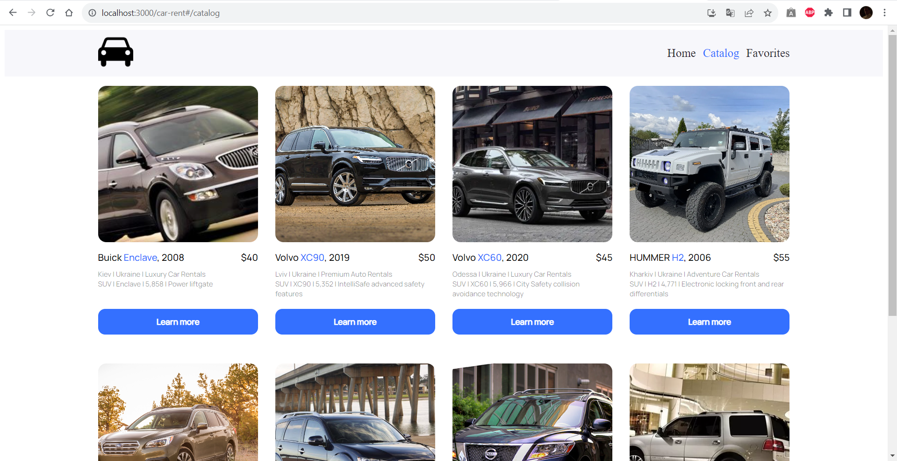

# Car Rent App

Unfortunatelly, this project works only on my machine. I guess the problem with GitHub pages is in Routes or in file maps from build, because site can't reach components. Though http queries are working and getting data properly.

